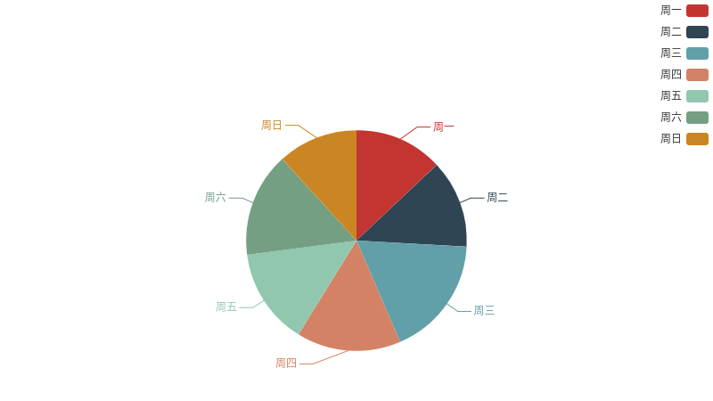
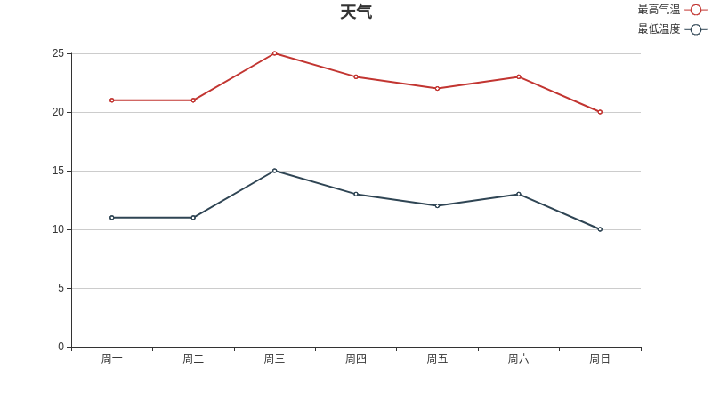
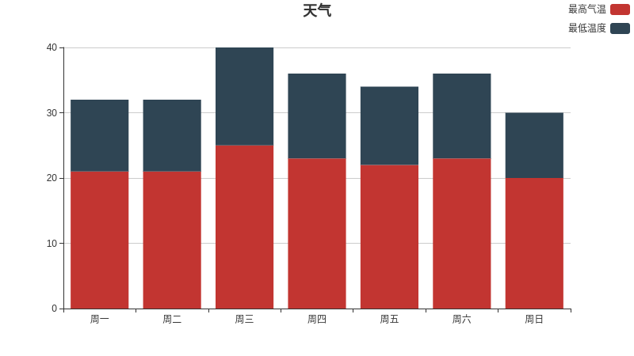
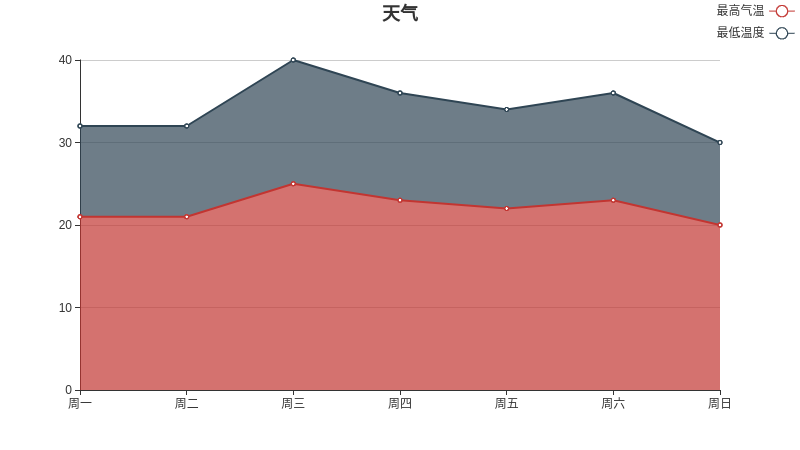

# echart-plotlib
A simple api for using echart in jupyter notebook. You can use these apis to plot line, stack, bar or pie. It's just for daily simple use. Welcome to contribute other echart plot options.

# How to use it?

```python
# test in jupyter notebook
from echartlib import echartlib
from IPython.display import HTML
echart = echartlib(width=800, height=450)
# plot line, and you can choose stack or tiled, bar or line in the graph
data_name = ["最高气温", "最低温度"]
xAxis_data = ['周一','周二','周三','周四','周五','周六','周日']
yAxis_data = [[21, 21, 25, 23, 22, 23, 20], [11, 11, 15, 13, 12, 13, 10]] # two dimension
HTML(echart.plot_line(data_name=data_name, xAxis_data=xAxis_data, yAxis_data=yAxis_data, title="天气"))

# plot area, and you can choose stack or tiled, bar or area in the graph
data_name = ["最高气温", "最低温度"]
xAxis_data = ['周一','周二','周三','周四','周五','周六','周日']
yAxis_data = [[21, 21, 25, 23, 22, 23, 20], [11, 11, 15, 13, 12, 13, 10]] #two dimension
HTML(echart.plot_else(data_name=data_name, xAxis_data=xAxis_data, yAxis_data=yAxis_data, title="天气"))

# plot pie
data_name = ["最高气温", "最低温度"]
data = [10, 20]
HTML(echart.plot_pie(data_name=data_name, data=data, title="天气"))
```

# Example

- pie



- line



- stack bar



- stack area



